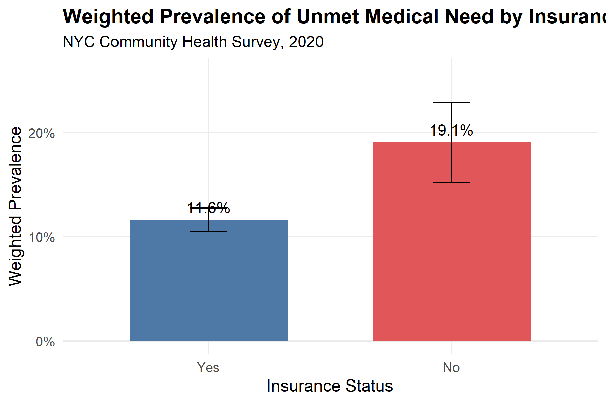
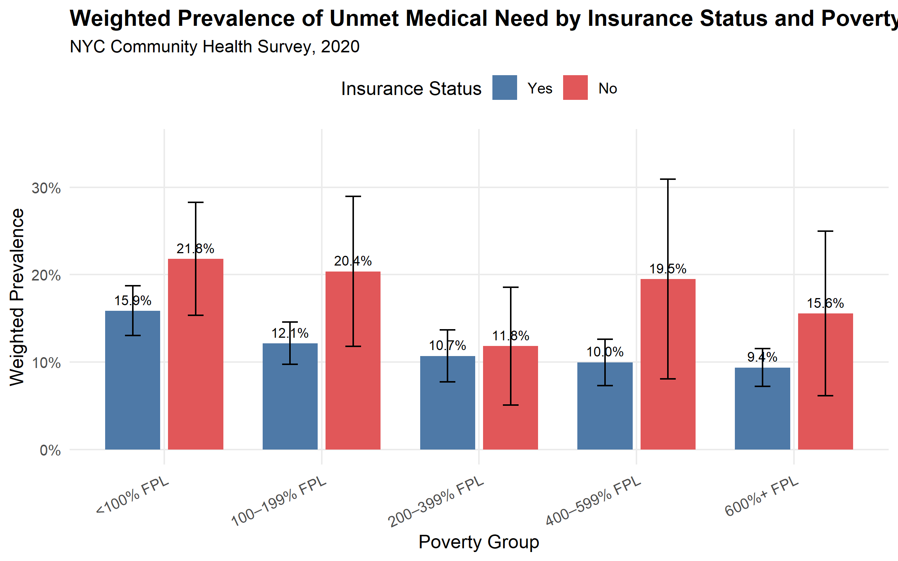
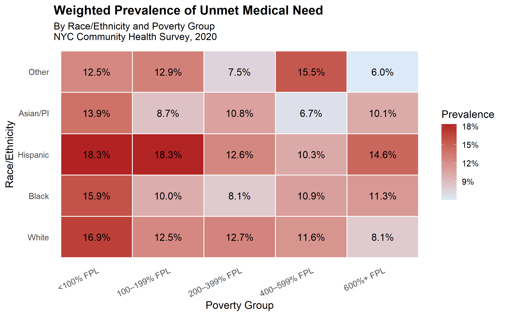
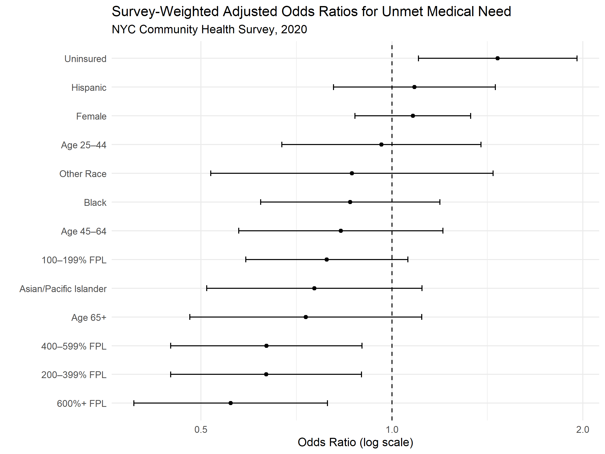

# Access to Care and Insurance Status in NYC

## Background

Access to healthcare is a major determinant of health outcomes and preventive care utilization. Lack of insurance coverage and socioeconomic barriers may contribute to delays in receiving needed medical care, particularly among low-income populations.

This project examines the relationship between insurance status and unmet medical need among adults in New York City using data from the 2020 NYC Community Health Survey (CHS), a population-based public health survey conducted by the NYC Department of Health and Mental Hygiene.

The analysis explores whether uninsured individuals are more likely to report not receiving needed medical care and evaluates how demographic and socioeconomic factors such as age, sex, race/ethnicity, and poverty status are associated with healthcare access.

---

## Methods

Analyses were conducted in R and included:

- Data cleaning and variable recoding
- Survey-weighted descriptive analysis
- Weighted prevalence estimation
- Survey-weighted logistic regression
- Data visualization using ggplot2

---

## Results

In survey-weighted unadjusted logistic regression analyses, uninsured NYC adults had higher odds of reporting unmet medical need compared with insured adults.

After adjusting for age, sex, poverty status, and race/ethnicity, uninsured respondents continued to have higher odds of unmet medical need, suggesting that insurance coverage remained independently associated with healthcare access.

Lower-income respondents experienced higher weighted prevalence of unmet medical need even among the insured, indicating that socioeconomic barriers to care persist beyond insurance coverage alone.

---

## Example Visualizations
### Unmet Medical Need by Insurance Status

### Unmet Medical Need by Insurance Status and Poverty

### Healthcare Access Disparities by Race/Ethnicity and Poverty Group

This heatmap displays the survey-weighted prevalence of unmet medical need across race/ethnicity and poverty groups.

Higher prevalence of unmet medical need was generally observed among lower-income respondents across multiple racial/ethnic groups. Hispanic respondents in lower-income categories experienced some of the highest levels of unmet medical need, highlighting the potential intersection of socioeconomic and demographic disparities in healthcare access.

As a descriptive visualization, the heatmap is intended to identify population-level patterns rather than establish causal relationships.

### Adjusted Odds Ratios for Unmet Medical Need

---

## Repository Structure

- `01_load_data.R` — loads raw CHS SAS dataset
- `02_clean_data.R` — cleans and recodes analytic variables
- `03_eda.R` — weighted exploratory analyses and visualizations
- `04_analysis.R` — weighted logistic regression analyses

---

## Data Source

Data were obtained from the 2020 NYC Community Health Survey (CHS).

Analyses incorporated CHS survey weights and stratification variables to account for the complex survey design and generate estimates representative of the NYC adult population.

The raw dataset is not included in this repository. Publicly available CHS data can be accessed through the NYC Department of Health.

## Skills Demonstrated

- R programming
- Survey-weighted epidemiologic analysis
- Logistic regression
- Data visualization using ggplot2
- Public health surveillance analysis
- Reproducible analytic workflows
