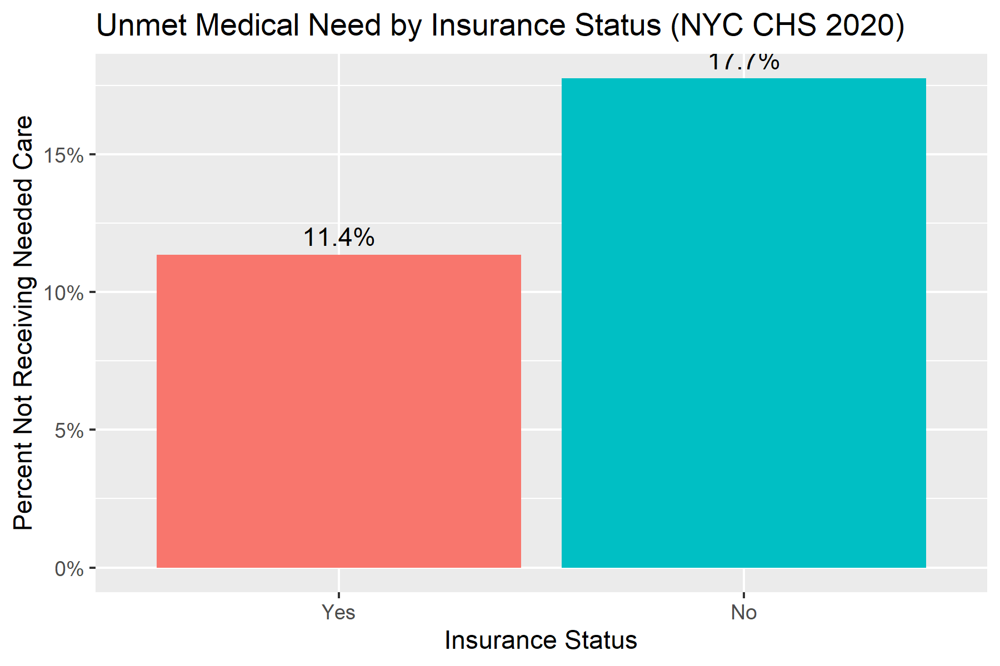
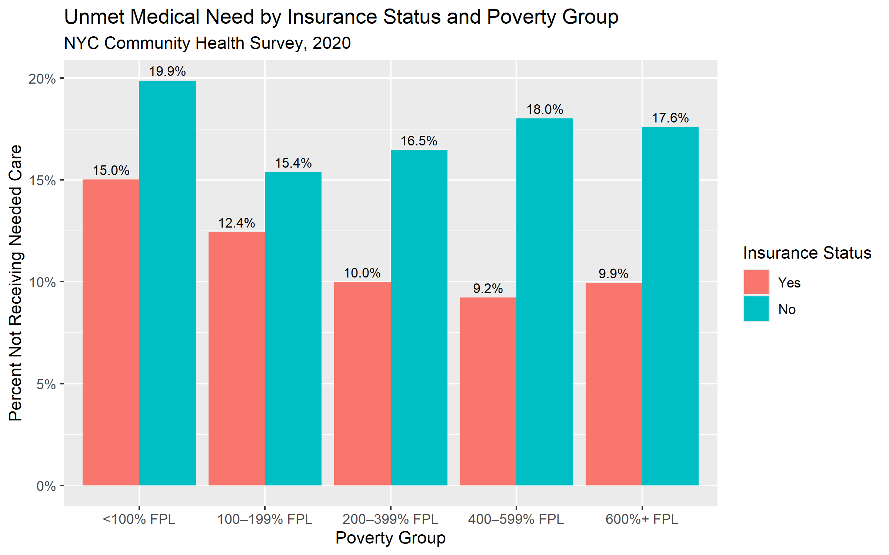
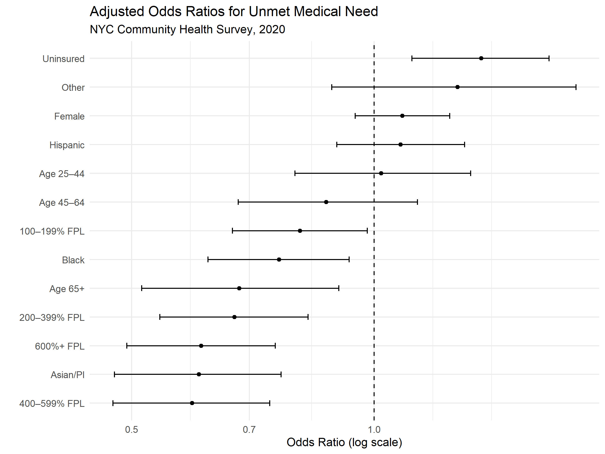

# Access to Care and Insurance Status in NYC

## Background

Access to healthcare is a major determinant of health outcomes and preventive care utilization. Lack of insurance coverage and socioeconomic barriers may contribute to delays in receiving needed medical care, particularly among low-income populations.

This project examines the relationship between insurance status and unmet medical need among adults in New York City using data from the 2020 NYC Community Health Survey (CHS), a population-based public health survey conducted by the NYC Department of Health and Mental Hygiene.

The analysis explores whether uninsured individuals are more likely to report not receiving needed medical care and evaluates how demographic and socioeconomic factors such as age, sex, race/ethnicity, and poverty status are associated with healthcare access.

---

## Methods

Analyses were conducted in R using:

- Descriptive statistics
- Stratified analyses
- Logistic regression
- Data visualization with ggplot2

---

## Results

In unadjusted logistic regression analyses, uninsured respondents had 1.68 times the odds of reporting unmet medical need compared to insured respondents.

After adjusting for age, sex, poverty status, and race/ethnicity, uninsured respondents continued to have higher odds of unmet medical need, suggesting that insurance coverage remained independently associated with access to care.

Lower-income respondents experienced higher levels of unmet medical need even among the insured, indicating that socioeconomic barriers to care persist beyond insurance coverage alone.

Differences in odds of unmet medical need were also observed across age and racial/ethnic groups, highlighting the complex demographic and socioeconomic factors associated with healthcare access in NYC.

---

## Example Visualization
### Unmet Medical Need by Insurance Status

### Unmet Medical Need by Insurance Status and Poverty

### Adjusted Odds Ratios for Unmet Medical Need

---

## Repository Structure

- `01_load_data.R` — loads raw CHS SAS dataset
- `02_clean_data.R` — cleans and recodes analytic variables
- `03_eda.R` — exploratory analyses and visualizations
- `04_analysis.R` — logistic regression analyses

---

## Data Source

Data were obtained from the 2020 NYC Community Health Survey (CHS).

The raw dataset is not included in this repository. Publicly available CHS data can be accessed through the NYC Department of Health.
